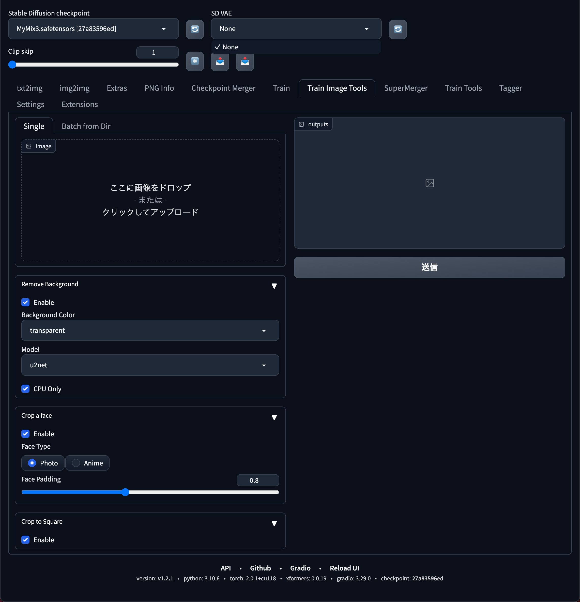

# sd-webui-train-image-tools
学習用の画像作成のためのツールです。

## オプション
### Remove Background
画像から背景を削除して人物のみにします。

### Face Only
画像から顔を検出して切り出します。

### Face Padding
検出した顔を切り出す際の余白部分のサイズです。

### Model
背景を削除する際のモデルを指定します。

### CPU Only
背景を削除する際にCPUのみで処理をするか指定します。
GPUを使用するにはonnxruntime-gpuが正しく動作するように環境を設定しておく必要があります。
